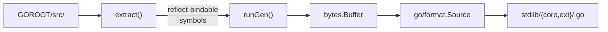

# cmd/extract

> Code generator that reflects on Go package source to emit
> `reflect.Value` bindings: standalone `ImportPackageValues` maps for
> embedding external packages, or stdlib binding files for mvm's build.

## Overview

`cmd/extract` walks a Go package's source tree and identifies its
exported symbols (`const`, `var`, `type`, `func`). What it emits depends
on the mode:

- **Default mode** writes a standalone `var <pkg>Values` map of
  `reflect.Value` entries that an embedder passes to
  `(*interp.Interp).ImportPackageValues`, exposing a native package to
  interpreted code. The target is given as an import path; its source is
  located with `go list`.
- **`-stdlib` mode** instead registers the symbols into `stdlib.Values`
  via an `init()` and is the only producer of files under
  `stdlib/core/` and `stdlib/ext/`.
- **`-list` mode** prints a raw `<kind> <name>` listing, for debugging
  what a package exposes.

The `-stdlib` mode is invoked indirectly through `make generate`, which
calls `go generate ./stdlib` (driven by directives in `stdlib/gen.go`)
and then loops over `go tool dist list` to emit one `syscall` binding
per platform.

## Usage

Three modes, the default selected when neither `-stdlib` nor `-list` is
set:

```
# Default mode: write an ImportPackageValues binding map for an import
# path (source located via `go list` unless [dir] is given).
go run ./cmd/extract [-o out.go] [-pkg name] <import-path> [dir]

# Stdlib mode: write a binding file under ./core/ or ./ext/.
go run ./cmd/extract -stdlib <import-path> <src-dir>

# List mode: print exported symbols to stdout (or -o file).
go run ./cmd/extract -list <src-dir>
```

A relative or `.` target in the default mode is canonicalized to its
real import path by `go list`, so `extract .` run inside a package
directory emits the correct `import` and map key.

Flags:

| Flag | Purpose |
|------|---------|
| `-stdlib` | Generate an mvm stdlib binding file. Output path is `./core/<file>.go` or `./ext/<file>.go` based on the `Core` map in `cmd/extract/categories.go`. |
| `-list` | Print a raw `<kind> <name>` symbol listing of `<src-dir>` instead of generating a binding. |
| `-o <path>` | Output file (default stdout); ignored when `-stdlib` is set. |
| `-pkg <name>` | Package clause for the default-mode bindings file (default `main`). |
| `-goos <os>` | Target GOOS for build-constraint filtering. Used for `syscall`. |
| `-goarch <arch>` | Target GOARCH. Used together with `-goos`. |

## Internal design

All three modes share `extract()` for symbol discovery and
`go/format.Source` for output. The diagram below shows the `-stdlib`
path (`runGen`); the default path (`runValues`) differs only in the
emitted file shape.



### Symbol extraction (`extract`)

`extract()` parses the package directory through mvm's own
`goparser`, with the build context optionally pinned via `-goos` /
`-goarch`. Symbols are filtered:

- **Exported only**: unexported names skipped.
- **No nested scopes or generic instantiations**: names containing
  `/`, `.`, or `#` are skipped (they cannot be expressed as a single
  `reflect.ValueOf`).
- **Untyped-int constants over `int64`**: wrapped as `uint64(...)` to
  avoid `reflect.ValueOf(untyped int constant) overflows int`. Named
  types are deliberately *not* wrapped, so bindings preserve e.g.
  `time.Duration` rather than collapsing it to `int64`.

Output is grouped by `symbol.Kind` (`Const`, `Var`, `Type`, `Func`)
and sorted within each group for deterministic generation.

### Code generation (`runGen`)

`runGen` writes through a `bytes.Buffer`, then runs `go/format.Source`
on the buffered text and writes the formatted bytes to the target
file. This makes generated output gofmt-clean by construction.
No post-pass `gofmt -w` is needed.

The emitted file structure:

```go
//go:build <tag>           // optional, from BuildTags or -goos/-goarch
// Code generated by cmd/extract; DO NOT EDIT.

package <core|ext>

import (
    "<importPath>"
    "reflect"

    "github.com/mvm-sh/mvm/stdlib"
)

func init() {
    stdlib.Values["<importPath>"] = map[string]reflect.Value{
        "Sym": reflect.ValueOf(pkg.Sym),
        ...
    }
}
```

Packages that expose only generic symbols produce a stub file with
just the package clause. Kept so bindings appear automatically once
the package gains non-generic exports.

### Default mode (`runValues`)

`runValues` resolves the target import path, runs the same `extract()`,
and renders a standalone binding map through `buildValuesFile` (again
`go/format.Source`-clean by construction). The emitted file structure:

```go
// Code generated by cmd/extract; DO NOT EDIT.

package <-pkg, default main>

import (
    "<importPath>"
    "reflect"
)

var <alias>Values = map[string]map[string]reflect.Value{
    "<importPath>": {
        "Sym": reflect.ValueOf(pkg.Sym),
        ...
    },
}
```

The outer key is the **canonical import path** (so interpreted
`import "<importPath>"` resolves), and `<alias>` is the package's
**declared name** (not the path's last element, so versioned paths like
`gopkg.in/yaml.v3` bind as `yaml`). `resolvePkg` obtains both from
`go list -f '{{.ImportPath}}\t{{.Dir}}\t{{.Name}}'`, rejecting a pattern
that matches multiple packages. When an explicit `[dir]` is given (for
packages `go list` cannot resolve) the import path is taken as supplied
and the name comes from `go/build.ImportDir`, which honors build
constraints and parses the clause (so a `//go:build ignore` `package
main` generator file is skipped and a trailing package-clause comment is
not mistaken for part of the name).

The same value/var/type shape as `runGen` is used: consts and funcs by
value, vars by address (`&pkg.V`), types as a typed nil pointer
(`(*pkg.T)(nil)`). A package with no exported symbols omits its own
import to keep the file compilable.

### `categories.go`

Top-level maps:

- **`Core`**: set of import paths routed to `stdlib/core/`. Everything
  not listed goes to `stdlib/ext/`. The criterion is "pure-compute and
  light on transitive deps" (see [ADR-013](../decisions/ADR-013-stdlib-core-ext-split.md)).
- **`BuildTags`**: optional whole-package `//go:build` expression. Gates
  `runtime/cgo` behind `cgo` (so `GOOS=js GOARCH=wasm` still links) and
  whole packages that only build on newer Go (`crypto/hpke`,
  `testing/cryptotest` on `go1.26`; `testing/synctest` on `go1.25`).
- **`SymbolBuildTags`**: per-symbol additions in newer Go releases,
  keyed by import path then `//go:build` expression. Those symbols are
  split out of the base file into a supplement `<pkg>_<suffix>.go`
  (e.g. `crypto_go126.go`) guarded by the tag, so the base files build
  on the oldest Go release named in `go.mod`'s `go` directive (1.24).
  Hand-maintained from `$GOROOT/api/go1.<N>.txt`; revisit on every
  toolchain bump. `tagFileSuffix` maps a tag to its filename suffix.

## Dependencies

- `github.com/mvm-sh/mvm/goparser`: used to parse the package source
  with the same build-tag handling as the interpreter itself, so
  `extract` sees only files that mvm would actually run.
- `github.com/mvm-sh/mvm/symbol`: `Kind`, `Symbol`.
- `github.com/mvm-sh/mvm/lang/golang`: Go language spec for the parser.
- `go/constant`: for the over-`int64` const detection.
- `go/format`: gofmt the buffered output before writing.
- `go/build`: `ImportDir` resolves the declared package name from an
  explicit `[dir]` while honoring build constraints (default mode).
- `os/exec`: runs `go list` to canonicalize an import path and locate
  its source (default mode).

## Open questions / TODOs

- Generated stubs for generics-only packages (`crypto/hkdf`,
  `crypto/pbkdf2`, `unique`, `weak`) are kept around to auto-populate
  on future Go releases. If a release adds non-generic exports, no
  manual action should be needed beyond `make generate`.
