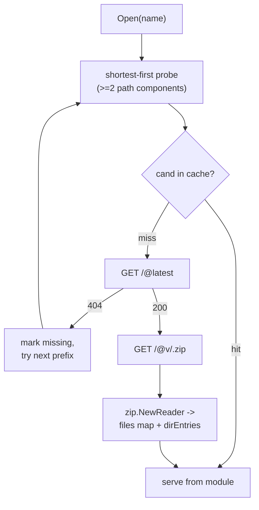

# modfs

> An `io/fs.FS` backed by the Go module proxy. Resolves import paths to
> source files over HTTP and caches them in memory.

## Overview

`modfs` plugs into `goparser.Parser` as the third-tier FS fallback (after
`pkgfs` and the embedded stdlib `srcfs`). When the parser encounters an
`import` whose source is not available locally, it falls through to the
modfs FS, which probes the configured Go module proxy, downloads the
module zip, parses it, and serves files from memory.

Two non-negotiables shape the design:

1. **No disk writes.** Module sources are kept entirely in memory. This
   avoids any dependency on `GOMODCACHE` or local filesystem state.
2. **WASM-compatible.** `fs.FS` is synchronous; `net/http` in WASM blocks
   the goroutine but yields to the JS event loop, so the FS works as-is
   without async plumbing in callers.

## Key types and functions

- **`FS`** -- implements `fs.FS`, `fs.StatFS`, and `fs.ReadDirFS`. Internal
  state is a per-process cache of loaded modules and a negative cache for
  module-path candidates that the proxy could not resolve.
- **`Options`** -- proxy URL (default `https://proxy.golang.org`) and
  HTTP client.
- **`New(opts Options) *FS`** -- constructor.
- **`DefaultProxy`** (`"https://proxy.golang.org"`) -- the public Go
  module proxy.

The integration point is `goparser.Parser.SetRemoteFS(fsys fs.FS)`, which
lets any `fs.FS` (not just modfs) be installed; modfs is the canonical
implementation.

## Internal design

### Resolution and fetch flow

`locate(importPath)` walks the candidate prefixes shortest-first
(starting at two path components, since a module path must contain a
slash). For each candidate it consults `f.modules` (cached load) and
`f.missing` (cached negative result) before issuing any request, so
once a path is resolved or proven absent, further lookups are
in-memory. The first prefix that resolves to a 200 from `/@latest` is
taken as the module path, and the remainder of `importPath` becomes
the sub-path within that module.

This is deliberately the simplest correct algorithm: no host
shortcuts, no version pinning, no `go.mod` walking. The cost is at
most one extra round-trip per first-encounter of a deeper module
(github paths cost one wasted probe of the bare host segment), which
amortises to zero over a session. The resolution layer will be
replaced wholesale once `go.mod` parsing lands.

### Module download

`fetchModulePath` issues two GETs against the proxy:

- `<proxy>/<escaped>/@latest` -- returns `{Version}`.
- `<proxy>/<escaped>/@v/<escaped-ver>.zip` -- the module zip.

`escapePath` performs the proxy's case encoding: every uppercase ASCII
letter becomes `!` followed by its lowercase form. Non-ASCII runes are
rejected (the proxy spec disallows them, and silent mis-encoding would
be worse than a clear error).

### In-memory module representation

A loaded `module` is a pair:

- `files map[string][]byte` -- relative path within the module to file
  bytes.
- `dirEntries map[string][]fs.DirEntry` -- directory path to a sorted
  slice of children.

The Go module zip wraps everything under a `<modPath>@<version>/` prefix;
`newModule` strips that prefix, then walks parent directories per file
to record (parent, child, isDir) tuples for `dirEntries`. Sorting
happens once at parse time so `ReadDir` returns entries in a stable
order without resorting.

### Concurrency

A single `sync.Mutex` guards all maps and is held for the duration of
each `locate` call, including the HTTP fetch. The interpreter parser is
single-threaded, so contention is not a concern. Concurrent use from
multiple parsers would serialize fetches; addressing that would require
per-module-path locking (a `singleflight.Group` would do).

### Negative caching

Once a candidate module path returns 4xx from `@latest`, it is added to
`f.missing` and skipped on subsequent probes. This means a single missing
import incurs at most `len(parts) - 1` proxy round-trips on first
encounter, then zero on retries.

## Dependencies

- Go stdlib only: `net/http`, `archive/zip`, `encoding/json`, `io/fs`,
  `path`, `strings`, `sync`. No third-party packages.

## Limitations / TODOs

- **No `go.mod` resolution.** Always uses `@latest`. There is no
  transitive-dependency walk; if module `A`'s code imports `B`, the
  parser triggers a separate modfs lookup for `B` which probes the
  proxy again and resolves to its own `@latest`, regardless of what
  `A`'s `go.mod` requires.
  TODO: parse each fetched module's `go.mod` `require` and `replace`
  directives into a flat `path -> version` map and consult it before
  probing. This would replace the known-host heuristic with explicit
  module boundaries (handling v2+ paths and sub-modules correctly),
  pin transitive deps to the version the upstream tested against, and
  cut the per-import round-trip count. Sloppy MVS (first-seen wins)
  is acceptable for an interpreter; full MVS is overkill. This also
  re-introduces version pinning, which removes the need for a
  user-facing `Pin` option.
- **No checksum verification.** `go.sum` and the Go checksum database
  are not consulted. Trust is delegated entirely to the proxy host.
- **Nested major-version modules not handled.** Shortest-first probing
  resolves `github.com/foo/bar/v2/sub` to `github.com/foo/bar` if the v1
  module exists at that path. Same `go.mod`-parsing iteration above
  fixes this.
- **Mutex held during I/O.** Acceptable for the single-threaded parser;
  would need per-path locking for a concurrent host.
- **Unbounded cache.** `modules`, `missing` grow for the lifetime of the
  FS. Acceptable for an interpreter session; a long-running host
  embedding modfs would need an eviction policy.

See [ADR-014](../decisions/ADR-014-dynamic-network-imports.md) for the
design rationale.
