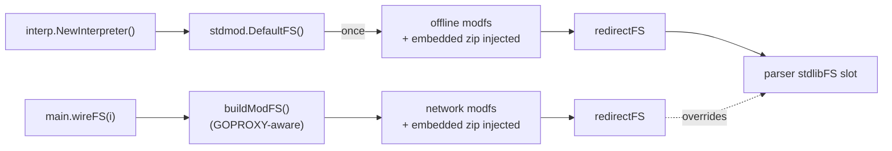

# stdmod

> Redirects stdlib-shaped import paths through `modfs` to the synthetic
> `github.com/mvm-sh/std` module.

## Overview

`stdmod` is the bridge between stdlib-style imports (`"errors"`,
`"slices"`, `"encoding/hex"`) and the proxy-format module that mvm uses
to serve them. It exists so that the parser sees one uniform pipeline
for all interpreted source -- whether the bytes come from the embedded
zip baked into the binary or from a network fetch through `proxy.golang.org`.

It sits between `interp/main` and `modfs`:

```
parser import "errors"
   |
   v
stdmod.redirectFS  --rewrite-->  github.com/mvm-sh/std/errors
   |
   v
modfs.FS  --serves from-->  in-memory module (injected zip or proxy fetch)
```

See [ADR-017](../decisions/ADR-017-std-module-redirect.md) for the
design rationale.

## Key types and functions

- **`ModulePath`** (`"github.com/mvm-sh/std"`) and **`Version`**
  (`"v0.1.0"`) -- compile-time pins. The embedded `stdlib/src.zip` must
  match these so `modfs.Inject` keys the in-memory module under the
  same path.
- **`Resolve() (modPath, version string)`** -- returns `(ModulePath,
  Version)` unless the `MVMSTD` env var overrides them. Format:
  `MVMSTD=<modpath>@<version>` (e.g. `github.com/myfork/std@v0.2.1`).
- **`IsStdlibImport(path string) bool`** -- true when `path`'s first
  segment contains no dot. Matches `cmd/go`'s stdlib-vs-module
  predicate.
- **`FS(backing *modfs.FS) fs.FS`** -- wrap an existing `*modfs.FS` in
  the redirecting `fs.FS`. Stdlib-shaped lookups are rewritten to
  `<modPath>/<path>` and delegated to `backing`; everything else
  returns `fs.ErrNotExist` so the parser falls through to its next FS
  in the chain.
- **`DefaultFS() fs.FS`** -- returns a redirect FS over an offline
  `*modfs.FS` pre-populated with the embedded std zip. Memoized via
  `sync.OnceValue`: every caller shares one parsed module so the zip
  walk runs at most once per process. Used by `interp.NewInterpreter`
  for the offline-default code path.

## Internal design

### Two construction paths, one redirect



`NewInterpreter` installs the default offline-only FS so embedders and
tests have a working stdlib without ceremony. `main`'s `wireFS` builds
a network-capable modfs for CLI invocations and overrides the slot,
because that modfs must also be reused as the parser's `remoteFS` to
share one cache between stdlib and third-party imports.

### Redirect logic

`redirectFS.rewrite(name)` returns `<modPath>/<name>` when
`IsStdlibImport(name)` is true, otherwise the empty string and `false`.
`Open`, `Stat`, and `ReadDir` each call `rewrite` and either delegate
to the backing modfs or return a `fs.PathError` with the appropriate
`Op` string. The redirect happens at the `fs.FS` boundary so neither
the parser nor `modfs` itself needs to know stdlib paths get treated
specially.

### Override via `MVMSTD`

The env var format is `<modpath>@<version>`. `Resolve` does a
`LastIndex("@")` split (last to allow `@` characters earlier in the
path, e.g. a hypothetical `gopkg.in` style). If no `@` is present the
whole string is taken as the modpath and `Version` is reused.

When `MVMSTD` overrides to a different module path or version, the
embedded zip (keyed under the compile-time `(ModulePath, Version)`) is
no longer the active key -- modfs falls through to the network on the
first lookup. The embedded bytes stay present in the binary but inert
for the override session.

## Dependencies

- `modfs/` -- the in-memory FS the redirect delegates to.
- `stdlib/` -- consumes `EmbeddedStd()` for the offline floor.

## Open questions / TODOs

- **Embedded-zip fallback under override.** When `MVMSTD` swaps to
  `github.com/myfork/std@v0.X.Y`, an offline user cannot resolve the
  override without first fetching it once. A "try the override first,
  fall back to the embedded if offline and the override matches the
  baked path" rule would be confusing; current behavior (override
  means override) is simpler. Worth revisiting only if a real use
  case arises.
- **Compile-time pin sync.** `stdmod.Version` and the version label
  baked into `stdlib/src.zip` (in `stdlib/gen_stdzip.go`) are bumped
  by hand after each std-repo retag. A `go generate` cross-check (e.g.
  fail loudly when the constants disagree) would prevent silent
  cache-miss-then-fetch behavior.
